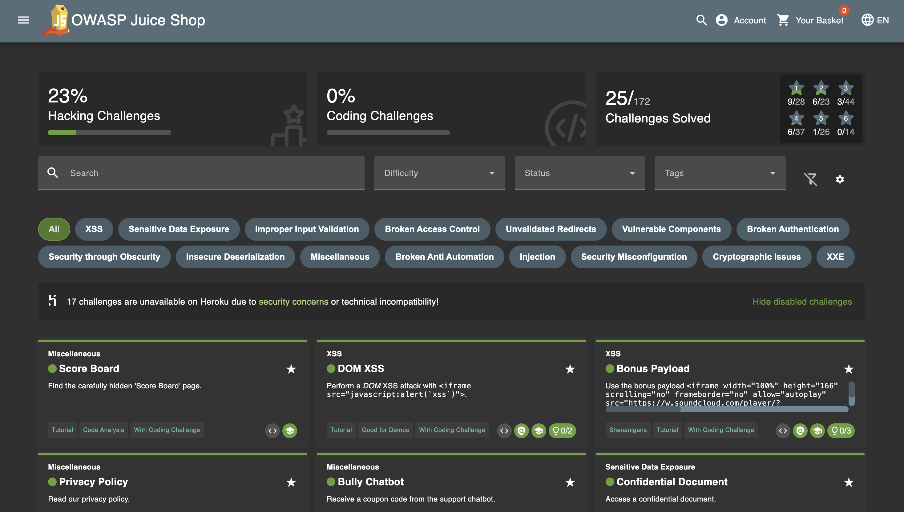
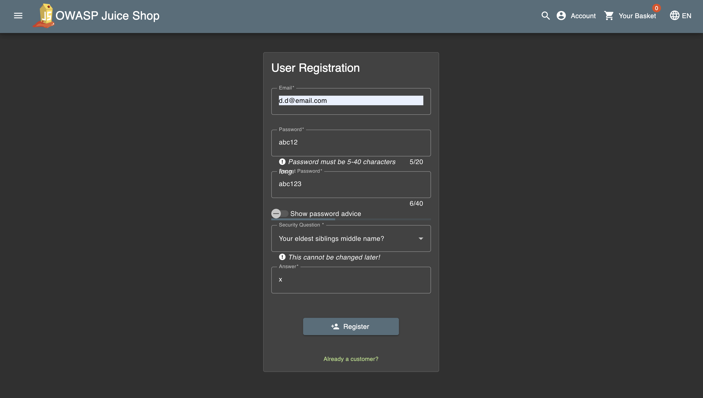
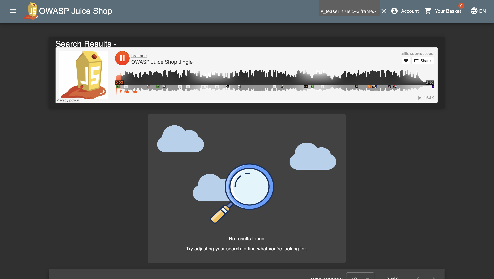

# OWASP Juice Shop Challenge Documentation

## Description

This document contains analysis, reproduction steps, and remediation recommendations for three completed OWASP Juice Shop challenges: Score-Board (hidden route), DOM-XSS (Bonus Payload), and Repetitive Registration. All security testing was conducted exclusively in a controlled test environment.

## Table of Contents

- [Description](#description)
- [Installation](#installation)
- [Environment Setup](#environment-setup)
- [Usage](#usage)
- [Challenge Documentation](#challenge-documentation)
  - [Metadata](#metadata)
  - [Overview](#overview)
  - [Score-Board Challenge](#score-board-challenge)
  - [DOM-XSS Challenge](#dom-xss-challenge)
  - [Repetitive Registration Challenge](#repetitive-registration-challenge)
- [Evidence Package](#evidence-package)
- [Remediation Recommendations](#remediation-recommendations)
- [Proof of Concept Snippets](#proof-of-concept-snippets)
- [Security Guidelines](#security-guidelines)
- [License](#license)
- [Contact](#contact)

## Installation

### Prerequisites

- Node.js (version 14.x or higher)
- npm or yarn package manager
- Docker (optional, for containerized deployment)

### Installation Steps

```bash
git clone https://github.com/juice-shop/juice-shop.git
cd juice-shop
npm install
```

### Docker Installation

```bash
docker pull bkimminich/juice-shop
docker run -d -p 3000:3000 bkimminich/juice-shop
```

## Environment Setup

### Local Development Environment

```bash
npm start
```

Access the application at `http://localhost:3000`

### Configuration Variables

Create a `.env` file with the following variables:

```env
NODE_ENV=development
PORT=3000
```

### Test Environment Requirements

- Isolated network environment
- No connection to production systems
- Local Juice Shop instance or container
- Browser DevTools enabled for testing

## Usage

### Starting the Application

```bash
npm start
```

### Running Tests

```bash
npm test
```

### Accessing the Application

Navigate to `http://localhost:3000` in your web browser.

## Challenge Documentation

### Metadata

- **Test Environment**: Local Juice Shop instance / Container / VM
- **Juice Shop Version**: OWASP Juice Shop (latest version)
- **Test URL**: https://juice-shop.herokuapp.com
- **Date / Time of Reproduction**: 02.11.2025 / 00:00
- **Author / Tester**: Tarik Sabanovic

**Note**: All activities were conducted exclusively in the described test environment.

### Overview

**Score-Board**: Hidden route (`/#/score-board`) was discovered through client-side resources — no specialized penetration testing toolkit required.

**DOM-XSS**: DOM-based Cross-Site Scripting vulnerability allows embedding of external iframe payload (SoundCloud player) and automatic loading/execution in the application context.

**Repetitive Registration**: Registration logic allows repeated submissions without sufficient server-side deduplication / missing idempotency → multiple accounts/entries possible.

### Score-Board Challenge

#### Objective

Discovery and access of the hidden Score-Board route.

#### Reproduction Steps

1. Start the test instance in a browser (https://juice-shop.herokuapp.com)
2. Open DevTools → Search loaded JS bundles for routes/strings (score-board, scoreboard)
3. Direct access: `https://juice-shop.herokuapp.com/#/score-board`

#### Expected Result

The Score-Board page is displayed; contents are readable.

#### Evidence

- Screenshot of the opened `/#/score-board` page (including URL and timestamp)
- Reference to the found string in the JS bundle (filename, line range)



### DOM-XSS Challenge

#### Objective

Demonstration of DOM-XSS by inserting the specified iframe payload; visibility/execution in the page context.

#### Payload Used (Exact)

```html
<iframe width="100%" height="166" scrolling="no" frameborder="no" allow="autoplay"
src="https://w.soundcloud.com/player/?url=https%3A//api.soundcloud.com/tracks/771984076&color=%23ff5500&auto_play=true&hide_related=false&show_comments=true&show_user=true&show_reposts=false&show_teaser=true"></iframe>
```

#### Reproduction Steps

1. Identify the vulnerable input location (e.g., comment/feedback field, product review, any location that writes user input to innerHTML)
2. Insert the payload into the input field and submit
3. Observe: the iframe is rendered; SoundCloud player loads and (depending on browser/autoplay policy) attempts to start

#### Technical Rationale

The application writes unfiltered user input to a DOM sink (e.g., innerHTML, insertAdjacentHTML), causing embedded HTML from third parties to be executed/rendered — classic DOM-XSS case.

#### Evidence

- Screenshot with rendered SoundCloud player (URL visible)
- Network Tab: Request to w.soundcloud.com (optional)
- Raw request with submitted payload (Network Tab / DevTools)



### Repetitive Registration Challenge

#### Objective

Proof that the registration logic does not robustly prevent multiple registrations.

#### Observed Behavior

Identical or slightly varied submitted registration data leads to multiple accounts/entries.

Missing server-side unique constraints or atomic check-and-insert logic.

#### Reproduction Steps

1. Open registration page
2. Fill form with `email=test@example.com`, `password=...`, `displayName=....`
3. Click "Register" multiple times or execute multiple identical POST requests (see PoC)
4. Observe: Repeated successful responses / multiple user entries

#### Possible Causes

- No unique constraint on email / username in the persistence layer
- Race conditions without transaction protection
- Missing idempotency token / missing rate limiting

#### Evidence



## Evidence Package

The following artifacts are included:

- **Screenshots**: Score-Board, rendered SoundCloud player, confirmation/display of multiple registrations


- **DevTools Logs**: Network Tab — Request/Response with payloads, session token (redacted if sensitive)
- **Short Timeline**: Date/time, tested URL, Juice Shop version
- **Test Description**: Notes on environment (local/container) and written consent to the test suite

## Remediation Recommendations

### A. Score-Board / Administrative Routes

- Move security-relevant paths behind server-side AuthN/AuthZ (RBAC/ABAC)
- Remove sensitive information from publicly deliverable client bundles
- Security reviews before publication of production frontend artifacts

### B. DOM-XSS

- Do not use innerHTML/outerHTML/insertAdjacentHTML with unfiltered input
- Use textContent or careful, context-sensitive encoding if HTML is not allowed
- Implement Content Security Policy (CSP) to restrict external script/iframe sources
- Whitelist sanitizer (e.g., DOMPurify) if restricted HTML permission is required
- DAST tests in CI for detection of DOM-XSS patterns

### C. Repetitive Registration / Idempotency

- Set server-side unique constraints (e.g., UNIQUE(email)) in the database
- Implement atomic check-and-insert operations (INSERT ... ON CONFLICT / UPSERT or transactions)
- Idempotency tokens and/or rate limiting for form submissions
- Email verification (Double Opt-In) to prevent abuse

## Proof of Concept Snippets

**Note**: Use only in the test environment.

### cURL — Repetitive Registration (Example)

```bash
curl -i -X POST 'https://juice-shop.herokuapp.com/api/Users/register' \
  -H 'Content-Type: application/json' \
  -d '{"email":"test@example.com","password":"P@ssw0rd!","displayName":"testuser"}'
```

Execute this command multiple times to demonstrate the issue.

### Browser Console — DOM-XSS (Demonstration, Test Only)

```javascript
// Set value in vulnerable input element and submit (test only)
document.querySelector('#commentInput').value = '<iframe src="https://w.soundcloud.com/player/?url=...&auto_play=true"></iframe>';
document.querySelector('#submitComment').click();
```

### Logging Guidelines

- Export Network Tab → "Save all as HAR" and add to evidence
- Take screenshots with visible URL + DevTools timestamp

## Security Guidelines

### Testing Environment

- All security testing must be conducted in isolated, controlled environments
- Never test against production systems without explicit authorization
- Document all test activities with timestamps and evidence

### Responsible Disclosure

- Report security vulnerabilities to the project maintainers through appropriate channels
- Do not publicly disclose vulnerabilities before remediation is available
- Follow responsible disclosure timelines and procedures

### Code Security Practices

- Validate and sanitize all user input
- Use parameterized queries to prevent SQL injection
- Implement proper authentication and authorization mechanisms
- Apply Content Security Policy headers
- Enable HTTPS in production environments
- Regular dependency updates and security audits

## License

This documentation is provided for educational and research purposes. OWASP Juice Shop is licensed under the MIT License.

## Contact

For questions or concerns regarding this documentation:

- **Project Repository**: https://github.com/juice-shop/juice-shop
- **Author**: Tarik Sabanovic
- **Repository**: https://github.com/ttariik/Juice-Shop-Master
